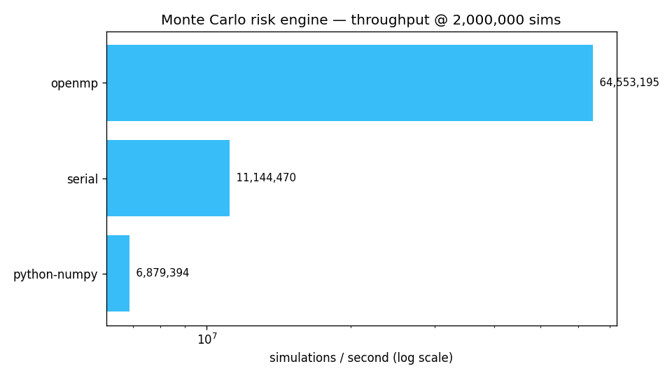

# Monte Carlo Risk Engine — multi-backend (Serial · OpenMP · CUDA)

[](https://en.wikipedia.org/wiki/C11_(C_standard_revision))
[](https://developer.nvidia.com/cuda-toolkit)
[](LICENSE)

A GPU-accelerated Monte Carlo engine that prices a portfolio of **correlated
assets** under geometric Brownian motion and estimates **Value-at-Risk (VaR)**
and **Conditional VaR / Expected Shortfall (CVaR)**. The same model is
implemented across four backends — **NumPy, Serial C, OpenMP C, and CUDA** — so
you can see exactly what parallelism buys you, with the guarantee that every
backend lands on the same risk numbers.

> A clean-room rebuild, written from scratch to learn HPC patterns for
> financial Monte Carlo (Cholesky correlation, parallel RNG streams, CUDA
> occupancy). Not a fork.

> **Hardware note:** this was developed and benchmarked on an AMD/CPU machine,
> so the **CUDA backend is written faithfully and fully documented but not run
> here** — it requires an NVIDIA GPU + `nvcc`. The speedup story below is
> reproduced with the backends that *do* run on commodity CPUs.

---

## The result (measured, 2,000,000 simulations, 16-thread CPU)

| Backend       | Threads | sims/sec   | Speedup | VaR(95%) | CVaR(95%) |
|---------------|--------:|-----------:|--------:|---------:|----------:|
| python-numpy  |       1 |  6,879,394 |   1.0×  |  641.6   |  837.1    |
| serial (C)    |       1 | 11,144,470 |   1.6×  |  639.7   |  835.1    |
| openmp (C)    |      16 | 64,553,195 |   9.4×  |  641.2   |  835.5    |



All three backends agree on VaR/CVaR to within Monte Carlo noise **despite using
three different RNGs** (NumPy PCG64, xoshiro256\*\* on CPU, Philox on GPU). That
cross-validation is the point: parallelizing the loop must not change the math.

## The model

Each asset `i` follows geometric Brownian motion, so its terminal price is

```
S_T(i) = S_0(i) · exp[ (μ_i − ½σ_i²)·T  +  σ_i·√T · z_i ]
```

where `z = L · x` turns a vector of i.i.d. standard normals `x` into
**correlated** normals using the lower-triangular **Cholesky factor** `L` of the
correlation matrix (`corr = L·Lᵀ`). The portfolio loss for one path is
`V_0 − V_T`. Across millions of paths:

- **VaR(α)** = the α-quantile of the loss distribution.
- **CVaR(α)** = the mean loss in the worst `(1−α)` tail.

## Architecture

```
include/montecarlo.h   model structs + RNG + single-path sim  (static inline, shared hot path)
include/timer.h        portable wall-clock (Windows + POSIX)
src/common.c           Cholesky · portfolio · VaR/CVaR · JSON output
src/serial.c           single-threaded reference  (numerical ground truth)
src/openmp.c           multi-core: per-thread RNG streams, disjoint slices
src/cuda.cu            GPU: cuRAND Philox · Cholesky in __constant__ · grid-stride
python/reference.py    NumPy baseline + independent validation
scripts/benchmark.py   runs all available backends, emits table + chart
```

Every backend reuses the **exact same `mc_simulate_loss()`** from the header —
they differ only in how the loop over independent paths is parallelized.

## Quick start

```bash
make                      # builds mc_serial + mc_openmp (needs gcc)

# No make? Compile directly (works on Linux, macOS, and Windows/MSYS2):
#   gcc -O3 -march=native -ffast-math -Iinclude src/serial.c src/common.c -o mc_serial -lm
#   gcc -O3 -march=native -ffast-math -fopenmp -Iinclude src/openmp.c src/common.c -o mc_openmp -lm

./mc_openmp 5000000       # 5M sims; prints JSON with VaR/CVaR + throughput
./mc_serial 1000000 42 0.99           # n_sims, seed, alpha
./mc_openmp 1000000 42 0.95 my.csv    # custom portfolio

python scripts/benchmark.py           # benchmark + docs/throughput.png
python python/reference.py 1000000    # NumPy baseline (add --pure for the slow loop)
```

Output is one JSON line per run:

```json
{"backend":"openmp","n_sims":5000000,"threads":16,"seconds":0.068,
 "sims_per_sec":74031410,"V0":5460.0,"mean_loss":-334.7,"alpha":0.95,
 "VaR":640.57,"CVaR":835.30}
```

## Building the CUDA backend (NVIDIA only)

```bash
make cuda
# or:  nvcc -O3 -Iinclude src/cuda.cu src/common.c -o mc_cuda -lcurand
./mc_cuda 100000000        # 100M paths
```

CMake auto-detects CUDA and builds `mc_cuda` only when a toolkit is present:

```bash
cmake -B build && cmake --build build --config Release
```

### Why the GPU version is fast

- **Philox cuRAND** (counter-based) instead of XORWOW → fewer registers, higher occupancy.
- **Cholesky factor in `__constant__` memory** → broadcast reads from the constant cache.
- **Grid-stride loop** sized to `multiProcessorCount × 32` → saturates the SMs.
- **Coalesced writes** of per-path losses → avoids the RNG/reduction memory bottleneck.

## Custom portfolios

Pass a CSV as the 4th argument. Format:

```
<n_assets>,<horizon_years>
S0,mu,sigma,weight        # one line per asset
...
<correlation matrix>      # n rows × n cols
```

The correlation matrix must be symmetric positive-definite (the Cholesky step
returns an error otherwise).

## License

MIT — see [LICENSE](LICENSE).
